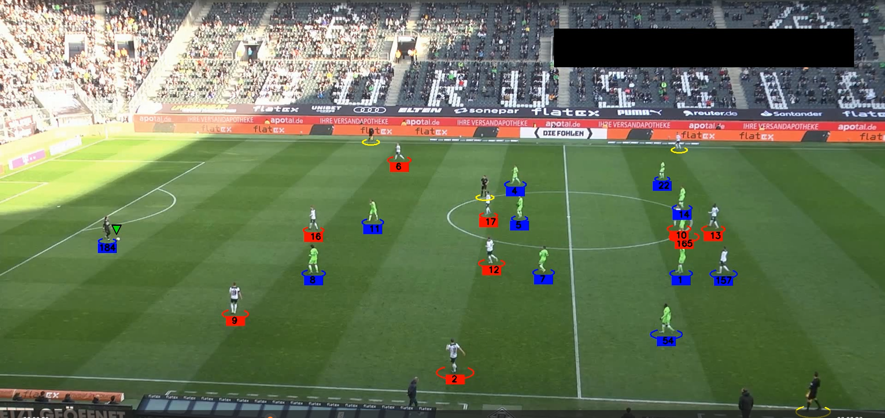
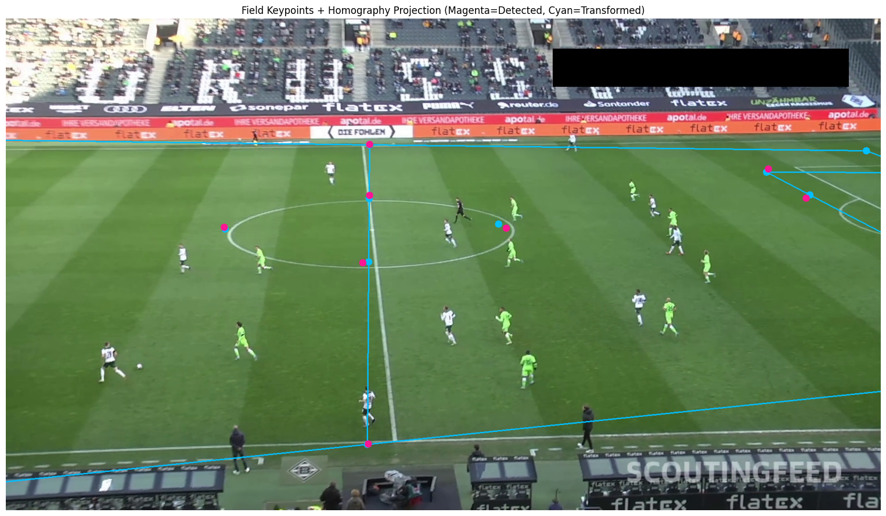
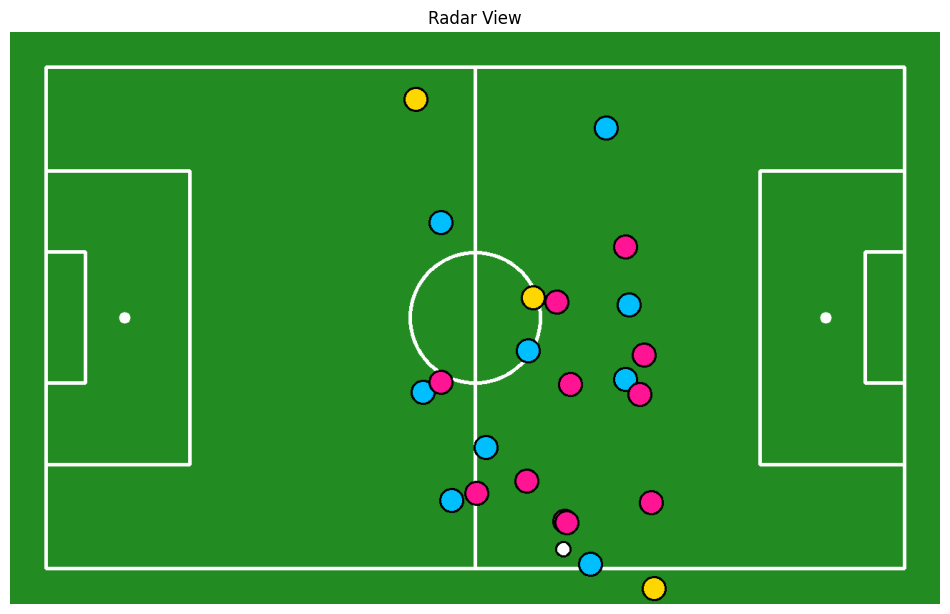
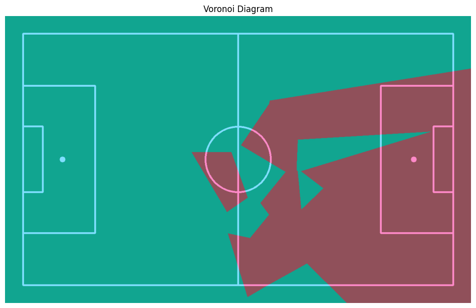

# ⚽ Football Match Analytics: AI-Powered Computer Vision Pipeline

[](https://www.python.org/)
[](https://github.com/ultralytics/ultralytics)
[](https://github.com/ifzhang/ByteTrack)
[](LICENSE)

An end-to-end **Computer Vision and Spatial Analytics Pipeline** designed for automated football match analysis. The system detects and tracks **players, referees, and the ball** in broadcast footage, classifies teams via jersey color clustering, and performs camera-to-pitch homography transformation to generate **2D Tactical Radar Views** and **Pitch Control (Voronoi) Diagrams**.

---

## 🎥 Visual Demos & Tactical Analytics

### 1️⃣ Object Detection & Multi-Object Tracking
Detects players, referees, and the ball while assigning persistent tracking IDs across continuous frames.

<p align="center">
  
</p>

---

### 2️⃣ Pitch Keypoint Detection
Extracts field keypoints to construct perspective transform matrices for camera-to-pitch alignment.

<p align="center">
  
</p>

---

### 3️⃣ 2D Tactical Radar View
Maps broadcast camera coordinates to a standardized top-down tactical grid showing live player, referee, and ball positions.

<p align="center">
  
</p>

---

### 4️⃣ Spatial Dominance & Pitch Control (Voronoi Partitioning)
Calculates real-time spatial control using Voronoi diagrams based on player positions and relative pitch geometry.

<p align="center">
  
</p>

---

## 📌 Visual Indicator Guide

| Element | Visual Representation | Technical Description |
| :--- | :--- | :--- |
| **Player Bounding** | Ellipse Marker | Bounding box anchor mapped to field contact point |
| **Tracking ID** | Numerical Label | Persistent multi-object tracking identifier via ByteTrack |
| **Team Membership** | Marker Color | Classified via unsupervised K-Means jersey color clustering |
| **Tactical Position** | 2D Pitch Coordinate | Homography-mapped real-world spatial coordinates |

---

## ✨ Key Features

* **Object Detection:** Detects players, referees, and the ball using Ultralytics YOLO models.
* **Multi-Object Tracking (MOT):** Assigns persistent IDs across video frames via ByteTrack.
* **Team Classification:** Unsupervised K-Means clustering on cropped jersey color spaces to automatically segregate teams.
* **Pitch Keypoint Detection:** Identifies field lines and intersections for perspective correction.
* **Homography Mapping:** Converts 2D broadcast camera perspective into a flat top-down tactical grid.
* **Pitch Control Analytics:** Dynamic spatial dominance partitioning using Voronoi diagrams.
* **Annotated Video Export:** Renders bounding overlays, tactical radar graphics, and analytics frame-by-frame.

---

# 🧠 System Pipeline

The system processes football videos using the following computer vision pipeline:

```
Input Video
│
Frame Extraction
│
YOLO Object Detection & Pitch Keypoint Detection
│
Convert detections to Supervision format
│
ByteTrack Multi-Object Tracking
│
Team Assignment (Jersey Color Clustering)
│
Perspective Transformation / Pitch Mapping
├───> 2D Radar View Plotting
└───> Pitch Control (Voronoi Diagram) Calculation
│
Annotated Video Output
```

Each detected object is assigned a **unique tracking ID** that remains consistent across frames.

Example:

```
Player #3 (Team 1)
Player #8 (Team 2)
Referee #1
Ball #10
```

This allows tracking player movement and analyzing gameplay.

---

# 📂 Project Structure

```
football_match_analysis_CV
│
├── development_and_analysis/
│   Experimental notebooks and modular analysis scripts
│
├── trackers/
│   Tracking logic and visualization utilities
│   ├── tracker.py
│   └── training_notebook.ipynb
│
├── utils/
│   Utilities for video reading, saving, and camera/pitch transformations
│
├── training/
│   Dataset preparation and training artifacts
│
├── input_videos/
│   Sample input videos
│   └── sample.mp4
│
├── output_videos/
│   Generated annotated videos and static images
│
├── main.py
│   Main script running the detection, tracking, and tactical analysis pipeline
│
├── main_pitch_keypoint_detection.ipynb
│   Notebook for pitch keypoint detection and perspective transformation
│
├── video_analysis.ipynb
│   Jupyter notebook for interactive video processing and analytics
│
├── yolo_interface.py
│   Interface for loading and running the YOLO detection model
│
├── output_one_frame_ss.png
├── output_keypointdetection.png
├── output_2d.png
├── output_pitch_control.png
│   Example output visualizations used in README
│
├── requirements.txt
├── README_SUMMARY.md
└── README.md
```

---

# 📊 Dataset

The detection model was trained using a **football player detection dataset from Roboflow Universe**.

Dataset link:
[Roboflow Football Players Detection Dataset](https://universe.roboflow.com/roboflow-jvuqo/football-players-detection-3zvbc/dataset/1)

### Dataset Classes

The dataset contains bounding box annotations for:
- Player
- Referee
- Ball

---

# 🏋️ Model Training

Model training is performed using the notebook located in:

```
trackers/training_notebook.ipynb
```

### Training Workflow

1. Load annotated dataset from Roboflow
2. Convert annotations into YOLO format
3. Configure training parameters
4. Train the YOLO detection model
5. Export the best trained weights to `models/best.pt`

---

# 🔍 Object Detection & Tracking

- **Object Detection (Ultralytics YOLO):** Predicts bounding boxes, class labels, and confidence scores for players, referees, and the ball.
- **Multi-Object Tracking (ByteTrack):** Integrated via the `supervision` library to maintain continuous, persistent tracking IDs across frames.

---

# 👕 Team Assignment

Players are automatically assigned to teams using **jersey color clustering**:
1. Extract player bounding box image crops.
2. Sample jersey color pixels while filtering pitch background.
3. Apply clustering (K-Means) to separate team colors.
4. Assign team labels and uniform color schemes to each tracked player.

---

# 🗺️ Keypoint Detection, Radar View & Pitch Control

- **Pitch Keypoints:** Detected via `main_pitch_keypoint_detection.ipynb` to establish spatial mapping parameters (`output_keypointdetection.png`).
- **2D Radar View:** Applies perspective transformation to map camera-view coordinates to a standardized 2D top-down pitch layout (`output_2d.png`).
- **Pitch Control (Voronoi Diagram):** Partitions field space based on relative player proximity to highlight dynamic spatial control (`output_pitch_control.png`).

---

# 📷 Output Files

```
output_videos/output_video.avi
output_one_frame_ss.png
output_keypointdetection.png
output_2d.png
output_pitch_control.png
```

This model is later used for **object detection during inference**.

---

# 🔍 Object Detection

Object detection is performed using **Ultralytics YOLO**.

The model predicts bounding boxes for:

- Players
- Referees
- Ball

Each detection includes:

- Bounding box
- Class label
- Confidence score

Example detection output:

```
Player — Confidence: 0.92
Referee — Confidence: 0.87
Ball — Confidence: 0.81
```

---

# 🎯 Multi-Object Tracking

Tracking is implemented using **ByteTrack**, integrated via the **Supervision library**.

Tracking ensures that each detected object receives a **persistent ID across frames**.

Example:

```
Frame 1 → Player ID 7
Frame 2 → Player ID 7
Frame 3 → Player ID 7
```

This enables tracking **player movement throughout the match**.

---

# 👕 Team Assignment

Players are automatically assigned to teams using **jersey color clustering**.

### Method

1. Extract player bounding box
2. Sample jersey color pixels
3. Apply clustering to separate team colors
4. Assign team label to each player

Example:

```
Team 1 → Red
Team 2 → Blue
```

These colors are used to visualize team membership in the output video.

---

# 🎥 Output Visualization

The output video contains annotated detections including:

- Player bounding boxes
- Player tracking IDs
- Team colors
- Ball detection
- Referee detection

Players are visualized using **elliptical markers with their tracking ID**.

Example annotation:

```
Player #4  (Team 1 → Red)
Player #9  (Team 2 → Blue)
Referee #1
Ball
```

---

# 📷 Output Files

The pipeline generates the following outputs:

```
output_videos/output_video.avi
output_videos/ss_output.png
output_videos/image.png
```

The output video contains:

- Object detections
- Tracking IDs
- Team color annotations

---

# ⚙️ Installation

### 1️⃣ Clone the Repository

```
bash
git clone [https://github.com/aksahaha/football_match_analysis_CV.git](https://github.com/aksahaha/football_match_analysis_CV.git)
cd football_match_analysis_CV

```

### 2️⃣ Create Virtual Environment

```
python -m venv .venv
```

### 3️⃣ Activate Environment

Windows PowerShell:

```
.\.venv\Scripts\Activate.ps1
```

Mac / Linux:

```
source .venv/bin/activate
```

### 4️⃣ Install Dependencies

```
pip install -r requirements.txt
```

Main dependencies include:

- ultralytics
- supervision
- opencv-python
- numpy
- torch

---

# ▶️ Running the Project

Run the main pipeline:

```
python main.py
```

The script will:

1. Load the trained YOLO model
2. Process the input football video
3. Detect players, referees, and the ball
4. Track objects using ByteTrack
5. Assign teams using jersey color clustering
6. Generate an annotated output video

The final video will be saved in:

```
output_videos/output_video.avi
```

---

# 🔧 Files Updated

### `trackers/tracker.py`

Updated to:

- Draw players using **team-based colors**
- Use `team_color` as fallback if `team` label is missing

### `main.py`

Updated to run **team assignment logic using `TeamAssigner`**.

New fields added to player tracks:

```
team
team_color
```

These fields are used for **visualizing team membership**.

---

# 🚀 Future Improvements

Possible extensions include:

- Player pose estimation
- Ball trajectory prediction
- Pass detection
- Player heatmaps
- Tactical formation analysis
- Expected goals (xG) modeling
- Real-time match analytics

---

# 🧪 Technologies Used

- Python
- Ultralytics YOLO
- ByteTrack
- Supervision
- OpenCV
- NumPy
- PyTorch

---

# 👨‍💻 Author

**Abhishek**
